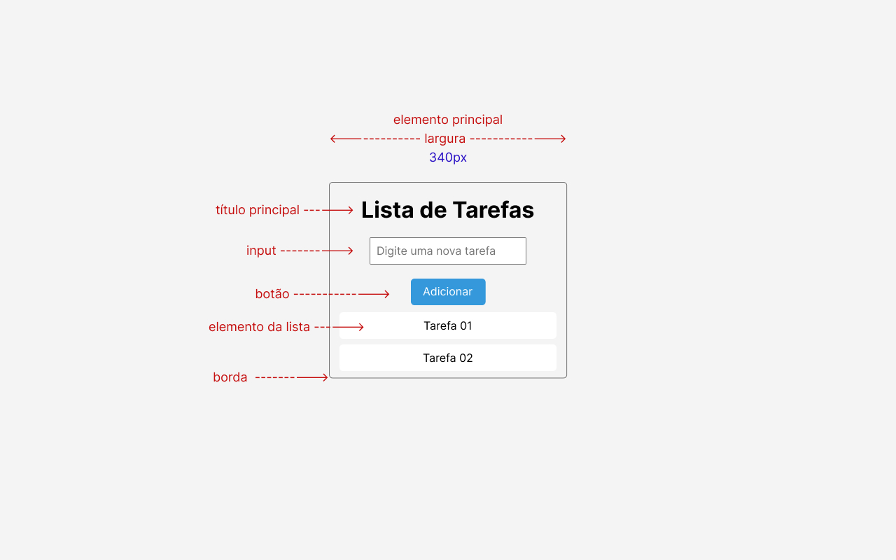

# Lista de Tarefas

<h2>Layout</h2>

<ul>
    <li>
        <h3><strong>body:</strong>
        <ul>
            <li>cor de fundo: #F4F4F4</li>
            <li>largura: 100%</li>
            <li>altura: 100%</li>
        </ul>
    </li>
    <li>
        <h3><strong>elemento principal:</strong>
        <ul>
            <li>largura: 340px</li>
            <li>cor de fundo: #F4F4F4</li>
            <li>descrição: o elemento principal deve estar
centralizado de forma tanto vertical quanto
horizontal com relação ao elemento pai (body)</li>
        </ul>
    </li>
    <li>
        <h3><strong>borda do elemento principal:</strong>
        <ul>
            <li>largura: 1px</li>
            <li>cor: #767676</li>
            <li>arredondamento das bordas: 5px</li>
        </ul>
    </li>
    <li>
        <h3><strong>título principal:</strong>
        <ul>
            <li>distância da borda superior: 20px</li>
            <li>alinhamento de texto: centralizado</li>
            <li>tamanho da fonte: 32px</li>
            <li>peso da fonte: bold</li>
            <li>família da fonte: sans-serif</li>
        </ul>
    </li>
    <li>
        <h3><strong>input:</strong>
        <ul>
            <li>distância do elemento superior: 20px</li>
            <li>largura: 224px</li>
            <li>espaçamento interno entre as bordas: 10px</li>
            <li>largura da borda: 1px</li>
            <li>cor da borda: #767676</li>
            <li>arredondamento da borda: 2px</li>
            <li>cor de fundo: #fff</li>
            <li>tamanho da fonte: 16px</li>
            <li>família da fonte: sans-serif</li>
            <li>peso da fonte: normal</li>
            <li>cor da fonte: #767676</li>
        </ul>
    </li>
    <li>
        <h3><strong>botão:</strong>
        <ul>
            <li>distância do elemento superior: 20px</li>
            <li>espaçamento interno entre as bordas horizontais: 10px</li>
            <li>espaçamento interno entre as bordas verticais: 17px</li>
            <li>cor da fonte: #fff</li>
            <li>cor de fundo: #3498DB</li>
            <li>tamanho da fonte: 16px</li>
            <li>família da fonte: sans-serif</li>
            <li>arredondamento das bordas: 5px</li>
        </ul>
    </li>
    <li>
    <h3><strong>botão com hover:</strong>
        <ul>
            <li>cursor do mouse: pointer</li>
            <li>cor de fundo: #2980b9</li>
        </ul>
    </li>
    <li>
    <h3><strong>elemento da lista:</strong>
        <ul>
            <li>distância do elemento superior: 10px</li>
            <li>distância para a borda inferior do elemento pai: 13px</li>
            <li>largura: 310px</li>
            <li>alinhamento de texto: centralizado</li>
            <li>cor de fundo: #fff</li>
            <li>cor da fonte: #000</li>
            <li>tamanho da fonte: 16px</li>
            <li>família da fonte: sans-serif</li>
            <li>peso da fonte: normal</li>
            <li>arredondamento das bordas: 5px</li>
            <li>espaçamento interno entre as bordas horizontais: 10px</li>
            <li></li>
        </ul>
    </li>
</ul>
